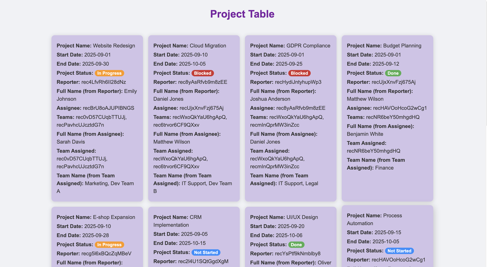
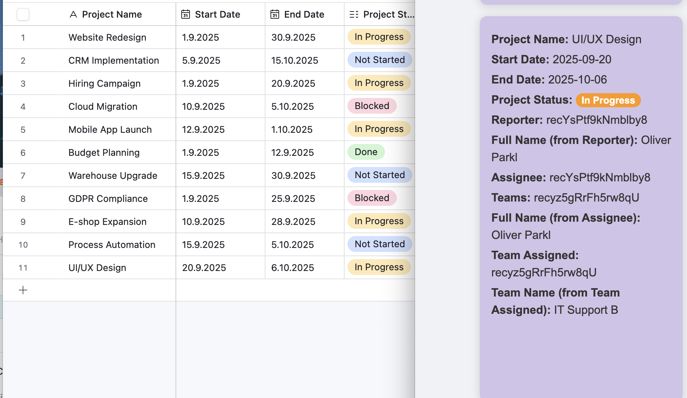
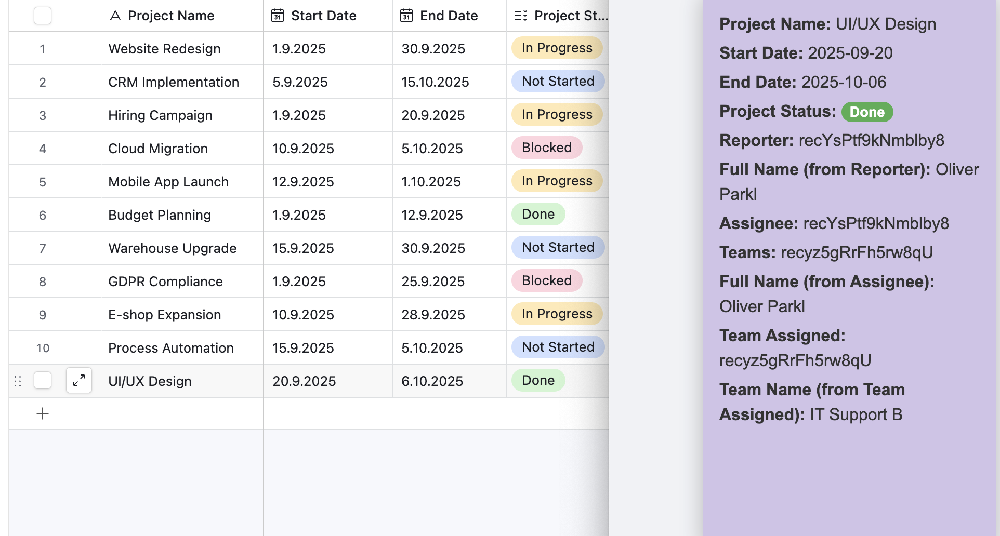

# 📊 Custom Airtable App

This project is a **custom web application** built with **React** and powered by the **Airtable API (Builder Hub token)**.  
It displays records from an Airtable **Project Table** as interactive cards, making it easier to view project data outside of Airtable.

---

## 🎯 Objective
Enhance the Airtable experience by creating a web app that:
- Fetches records from Airtable via API (using Builder Hub token).
- Displays each record as a **card** containing all its information.
- Creates a **new card automatically** when a new record is added in Airtable.
- Highlights the **Status field** with colors:
  - ✅ Done → Green  
  - ⏳ In Progress → Orange  
  - 🚀 Not Started → Dodger Blue  
  - ⛔ Blocked → Dark Red  

---

## ⚙️ Tech Stack
- **React (JavaScript)**  
- **Airtable API (Builder Hub Token)**  
- **CSS for custom styling**

---

## 📸 Screenshots

### Web App View
Here’s how the same data is displayed in the custom web app:  

### Airtable View
Here’s how the data looks directly inside Airtable:  

---

